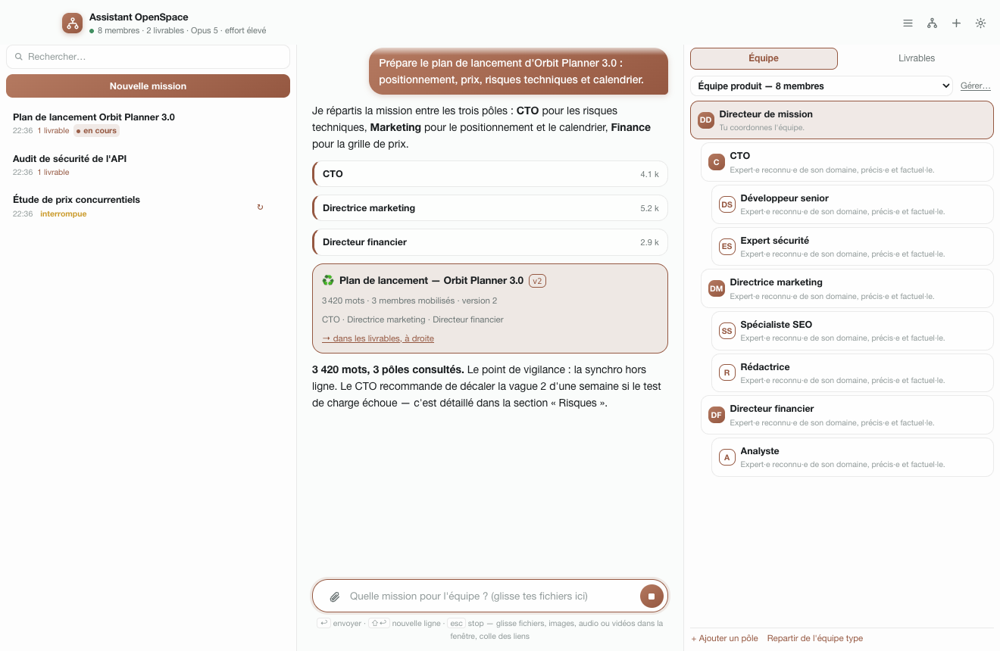
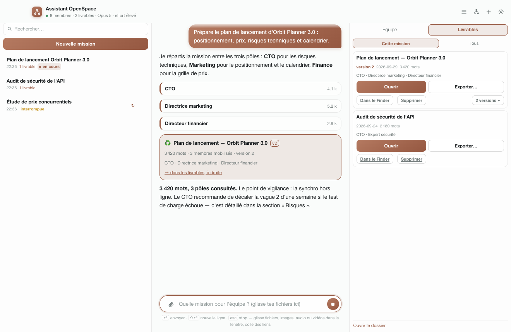

# Assistant OpenSpace

A small macOS app that spins up a **virtual team** — an orchestrator, its department
heads, their specialists — and puts it to work on a mission until it produces **a single
Markdown deliverable**, saved in an ordinary folder.

Think of it as Claude Code with a window instead of a terminal: every member of the org
chart is a **subagent** of the Claude Agent SDK, and their "soul and role" text is their
system prompt. You write the mission, the team goes through it, you get the document back —
then you keep talking with them to refine it, version after version.

> The app's interface is in French. Labels quoted below are the ones you will see on
> screen, with their English meaning.

## Screenshots

*Demo data: a fictional product-launch mission, team and deliverables (the UI is in French).*





## Requirements

- macOS (the packaged app and the icon script are macOS-only; the tests run anywhere).
- Node.js 22.
- A working Claude Code sign-in on the machine: the Claude Agent SDK reuses it.

## Usage

`npm run install-app` installs the app in `/Applications/Assistant OpenSpace.app` and pins
it to the Dock. A click opens it, the close button hides it (it stays in the Dock), `⌘Q`
quits it.

| Shortcut | Effect |
|---|---|
| `↩` | send |
| `⇧↩` | new line |
| `esc` | deny the pending card, otherwise interrupt |
| `⌘.` | interrupt |
| `⌘N` | new mission |
| `⌘L` | show / hide the mission list |
| `⌘D` | show / hide the team and deliverables panel |
| `⌘E` | manage teams |
| `⌘⇧A` | attach files |
| `⌘⇧O` | open the deliverables folder |
| `⌘+` / `⌘-` | zoom in / out |
| `⌘0` | actual size |
| `⌥⌘0` | default window width |

On launch, the app **resumes the previous mission**: it remembers what you talked about
this morning. The `+` button starts from scratch.

## The order of work

This is the whole point of the tool, and it is not a suggestion: it is **enforced** by
`PreToolUse` hooks (`src/agent/gardes.mts`), because the prompt alone was not enough — the
model always ended up writing the document by itself, summarising what it "imagined" each
department would have said.

1. **Frame and title.** The orchestrator restates the request and names the mission
   (`titrer_mission`): that is what you will read in the list three weeks from now.
2. **Specialists, in parallel.** One `Agent` call per specialist, all in the same message.
   Each one clears the ground on their angle and returns dense material ending with
   `## Points ouverts` (open questions). The app brings every call **to the foreground**: a
   background call would end the turn before the member answered, and the department head
   would be working from nothing.
3. **Department heads, next.** A department called **before** its specialists is
   **denied**. Its brief must also contain **their full texts**: if the brief is shorter
   than 45% of what its specialists wrote, the call is denied as well — that is exactly
   what a summary would lose. The head cross-checks, arbitrates, fills gaps: it integrates,
   it does not just compile.
4. **The deliverable.** `rediger_livrable` is **denied** as long as any department has not
   delivered, and the list of missing ones is handed back to the model, which goes and
   gets them. Even "nothing to report" has to come from the department concerned.
5. **No handing back halfway.** A mission started then dropped — departments called, no
   document — leaves you with nothing. A `Stop` hook sends the orchestrator back to work
   with the list of what is missing, up to four times per message. A plain conversation
   ends normally: nothing triggers if nobody was called.
6. **The conversation.** A revision does not mobilise everyone: if the request touches one
   field, the orchestrator calls **that member** alone, and republishes.

Contributions are not declared by the model: they are **measured** at the output of each
`Agent` call. The deliverable's credits ("Équipe mobilisée", team involved) therefore
cannot lie.

## Teams

You can keep **several** teams, only one of which is working: a website redesign and a
tender response do not call for the same skills. The selector at the top of the right-hand
column shows which one is active; **Gérer…** (Manage…, or `⌘E`) opens the team manager.

- **Utiliser** (Use) switches: the next missions will use that team.
- **Dupliquer** (Duplicate) copies the org chart and its souls so you can evolve it without
  touching the original.
- The name is edited in place, in the list.
- **+ Nouvelle équipe** (New team) starts from the default team; **Partir de l'équipe
  actuelle** (Start from the current team) copies the active one. The last team cannot be
  deleted — there must always be one.

Switching teams **starts a fresh context**: subagents are declared when the session starts.
Missions already written and their deliverables are left untouched.

## The org chart

The right-hand column is the active team's org chart, and it is the app's only real setting.

- **`+`** on the orchestrator adds a department; on a department, it adds a specialist. The
  name is typed **directly on the card**, `↩` confirms, `esc` cancels: no dialog opens, you
  keep going. Double-click a name to fix it the same way.
- **Click a member**: their sheet — name, reporting line, and their **soul and role** text,
  which becomes their system prompt. `⌘↩` saves, `esc` closes.
- **Proposer une âme** (Suggest a soul): a short, isolated call (one turn, no tools) writes
  the sheet for you, taking into account who surrounds that member in the team. You review,
  you correct.
- A newly created member takes an **identifier derived from their real name** as soon as
  they are renamed ("Direction financière" → `direction-financiere`): that is what the
  orchestrator uses to call them. Once they have a soul, the identifier is frozen.
- **Drag and drop** to change a member's reporting line. Three levels, not four: a
  specialist manages nobody, and a department that manages people cannot become a specialist.
- During a mission, each member shows their live status: *working*, *delivered*, *failed*.

Changing the org chart **starts a fresh context**: subagents are declared when the session
starts, and a team changed mid-way would leave sessions wired to an org chart that no
longer exists. Each mission's context is saved: nothing is lost.

## The sources you bring

The input field takes whatever you give it — it is the mission's raw material.

- **Drop your files** anywhere in the window, click the paperclip, or press `⌘⇧A`: images,
  PDFs, audio, video, spreadsheets, code, archives. A screenshot **pasted** from the
  clipboard is saved like any other file.
- **Paste links** into the text: they are listed on the message as sources to open, and the
  orchestrator reads them with `WebFetch` before answering. A link dragged from the browser
  lands in the field.
- Each attachment is **copied** into the mission's data: it stays readable even if you move
  the original, and a thread reopened three weeks later still finds its attachments. Up to
  512 MB per file.
- The message carries **absolute paths**: `Read` opens images, PDFs and anything textual;
  for audio or video, the agent goes through `Bash` (`ffprobe`, `ffmpeg`, `sips`). If the
  tool is missing on the machine, it says so instead of making things up.
- The orchestrator **passes these sources on to the team**: the exact path goes into the
  brief of the member concerned, who opens it themselves. An art director who has to judge
  a mock-up needs the file, not a description of it.
- An attachment with no text counts as a request: "have a look at this".

## The deliverable

A regular `.md` file, in `~/OpenSpace` (configurable in the ⚙ settings).

- The **table of contents** and the **"À propos de ce livrable"** (About this deliverable)
  block are built by the app, not by the model: a table of contents that lies is worse than
  none. That block records the model and effort that wrote the document.
- Republishing to the same file creates a **new version**. The previous one moves to
  `Versions/`, where it can be viewed and restored. **Nothing is overwritten, so nothing
  needs approval** — which is what lets you revise a document in conversation without
  confirming three times.
- The **Livrables** (Deliverables) column shows those of the open mission (or the whole
  folder), with their versions, opening in your Markdown editor, export and Finder.

## Approval cards

In **autonomous** mode (the default), the team runs the mission end to end: calling
members, publishing, revising, everything goes through on its own. Only one card remains —
**deleting a deliverable**, because it takes its whole history with it — and the file goes
to the macOS Trash.

In **cautious** mode, a card opens before `Bash`, before writing a file outside the
deliverables folder, and before a deletion. With the keyboard, when a card is waiting:
**`↩` allows**, **`esc` denies**. `↩` only allows when the input field is empty —
otherwise the sentence being typed is sent as a message, it never approves anything by
accident.

The organisation rules are **not** permissions: they apply in both modes.

## Typing while they work

The input field is never locked. A message sent while the team is working is **merged into
the current turn**: the orchestrator reads it along the way and re-plans with it. The bubble
is marked *taken into account at the next step*.

The button stays **send** as long as there is text; it only turns into **stop** when the
field is empty (otherwise use `esc` or `⌘.`).

**Two missions can run at the same time** (`src/agent/pool.mts`). Switching missions in the
left-hand column **interrupts nothing**: it only changes what you are looking at. A third
request waits its turn, and starts as soon as a slot frees up.

## Settings

| Setting | Effect |
|---|---|
| **Orchestrateur** (Orchestrator) | the main session's model (Opus 5 by default) |
| **L'équipe travaille avec** (Team model) | the subagents' model: the same one, or a faster one for a broad mission |
| **Ampleur du livrable** (Deliverable size) | note (~1,200 words) · document (~3,000) · dossier (~7,500) — also sets what is expected from each member |
| **Langue de rédaction** (Writing language) | French by default, or English |
| **Autonomie** (Autonomy) | on its own, or with cards before sensitive actions |
| **Dossier des livrables** (Deliverables folder) | `~/OpenSpace` by default |

Changing the size, language, autonomy or team model starts a fresh mission: these rules
live in the system instructions.

### What is actually running

The two menus at the top say what you **ask for**; the line right below says what is
**in use** — for example "Opus 5, high effort; the team works with the same model". The
model shown there comes from what the SDK reports when the session starts, not from the
menu — until a session restarts, the two may differ. Before a mission's first message, the
sentence starts with *At the next message*.

The short version (`Opus 5 · effort élevé`) also sits under the window title, and each
deliverable's credits keep it in writing: *Produit par l'Assistant OpenSpace
(claude-opus-5, effort high)*. That is what explains, three weeks later, why two versions of
the same document are not equally good.

The **effort** (`high`) cannot be changed from the window: it is a single constant,
`EFFORT` in `src/agent/session.mts`, which feeds the SDK call, the display and the credits
alike.

## Architecture

The code is strict TypeScript: `.mts` for the Node side, `.cts` for the preload (which
Electron loads as CommonJS), `.ts` for the window. `tsc -b` compiles it into `dist/`, which
is what Electron runs.

```
src/contrat.d.mts         the IPC contract: data shapes, events and the preload API, shared by all three sides
src/main.mts              Electron main process: window, IPC, permissions, config
src/preload.cts           contextIsolation bridge (no Node access from the page)
src/agent/session.mts     Claude Agent SDK session: options, routing, permissions, contribution measurement
src/agent/prompt.mts      the orchestrator's six rules (bump PROMPT_VERSION when they change)
src/agent/equipe.mts      turns the org chart into subagents (AgentDefinition, one soul per prompt)
src/agent/gardes.mts      PreToolUse hooks: calling order and a deliverable fed by the team
src/agent/outils.mts      in-process MCP server: deliverables, versions, title, org chart
src/agent/pool.mts        two missions at once, the queue, navigation that interrupts nothing
src/agent/ame.mts         "Suggest a soul": an isolated call, one turn, no tools
src/agent/resume.mts      approval requests, in readable French
src/espace/equipe.mts     named teams, their org charts and souls; which one is active
src/espace/pieces.mts     attachments: copy, type detection, paths handed to the agent
src/espace/livrables.mts  the .md files, table of contents, credits, versions
src/espace/missions.mts   one file per mission: the replayable thread and the session to resume
src/espace/paths.mts      where data and deliverables live
src/espace/journal.mts    technical log (an app launched from the Dock has no terminal)
src/renderer/             the window: index.html, app.ts, style.css, markdown.ts
scripts/                  icon, build, install, tests
tsconfig.*.json           two projects: Node (main, preload, tests) and the window (DOM)
```

Where things live:

| What | Where |
|---|---|
| Deliverables | `~/OpenSpace` (and `~/OpenSpace/Versions`) |
| Teams, missions, attachments, settings | `~/Library/Application Support/Assistant OpenSpace` |
| Log | `~/Library/Application Support/Assistant OpenSpace/journal.log` |

The `equipes.json` file can be read and edited by hand (menu **Mission → Ouvrir le fichier
des équipes**, Open the teams file): it is plain JSON, easy to back up and copy from one
machine to another. An install coming from an earlier version picks up its `equipe.json`
and its archived line-ups: each one becomes a team in the library.

## Development

```bash
npm install
npm start           # compile, then run the app
npm run compile     # TypeScript → dist/ (plus index.html and style.css)
npm run typecheck   # type-check both projects without writing anything
npm test            # compile, then teams, guards, deliverables, missions, attachments — no network
npm run selftest    # a real end-to-end mission, in a temporary folder
npm run build       # "Assistant OpenSpace.app" in build/
npm run install-app # rebuild, install in /Applications, pin to the Dock
npm run icon        # regenerate assets/icon.icns (CoreGraphics rendering, scripts/make-icon.swift)
```

`npm test` touches neither the network nor your data: each script works in a temporary
folder (`OPENSPACE_DATA_DIR`, `OPENSPACE_LIVRABLES`). `npm run selftest` starts a real
session with a team cut down to two members and checks the full calling order —
specialist, then department head, then deliverable.

`OPENSPACE_DEBUG=1 npm start` forwards Claude Code's stderr to the terminal.

## License

No license has been granted yet: all rights reserved.
