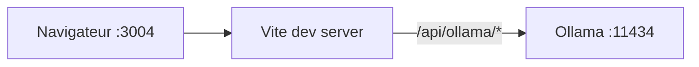

# Architecture — OpenSpace Localhost

## Vue d’ensemble

Application **SPA** React montée sur Vite. Aucun serveur applicatif Node dédié en dev : le serveur Vite sert les assets et proxy les appels Ollama.

## Interface

Styles globaux dans `src/index.css` : thème sombre minimal (variables CSS), pas de librairie UI. Objectif : lisibilité longue durée et patterns familiers (chat assistant / utilisateur, compositeur en bas).

## Arborescence `src/`

| Élément | Rôle |
|---------|------|
| `App.tsx` | État global : conversations, conversation active, onglet principal, modèle Ollama |
| `components/Layout.tsx` | Grille trois colonnes |
| `components/Sidebar.tsx` | Liste conversations + actions |
| `components/ChatPanel.tsx` | Modes Mission équipe / Discussion ; barre modèle |
| `components/MissionWorkspace.tsx` | Contexte, fichiers, pipeline, aperçu MD, téléchargement |
| `components/TeamPanel.tsx` | Arbre cliquable ; édition « âme et rôle » (persisté) |
| `components/AgentSoulModal.tsx` | Modale d’édition (Échap / Entrée / Maj+Entrée) |
| `data/teamSeeds.ts` | Textes initiaux (seeds) par id de nœud |
| `lib/teamSoulsStorage.ts` | Lecture / écriture `openspace-team-souls-v1` |
| `lib/ollama.ts` | Tags, `streamOllamaChat`, `completeOllamaChat` (orchestration) |
| `orchestration/pipeline.ts` | `runMissionPipeline` : orchestrateur → branches → README |
| `lib/storage.ts` | Sérialisation conversations `localStorage` |
| `types.ts` | Types partagés |

## Flux Chat (mode Discussion)

1. L’utilisateur envoie un message → ajout message `user` + bulle `assistant` vide.
2. `streamOllamaChat` lit le corps NDJSON ligne par ligne et concatène `message.content`.
3. À chaque chunk, mise à jour immuable des messages de la conversation active.
4. En cas d’erreur, suppression de la bulle assistant vide et affichage d’une bannière.

## Flux Mission équipe

1. Contexte + fichiers texte ; `loadAgentSouls()` lit les prompts par rôle.
2. `runMissionPipeline` enchaîne des `completeOllamaChat` (pas de stream) avec `system` = âme du nœud.
3. Sortie finale : markdown ; téléchargement blob côté client.

Voir `docs/mission-orchestration.md`.

## Évolutions prévues (non codées)

- Paralléliser les branches (3 directeurs) avec limite de concurrence.
- Colonne droite : journal détaillé par agent, pièces jointes enrichies.
