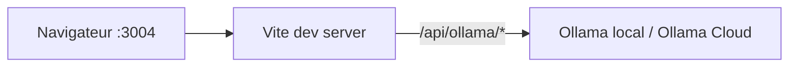

# Architecture — OpenSpace Localhost

## Vue d’ensemble

Application **SPA** React montée sur Vite. En **développement**, le serveur Vite sert les assets et proxifie les appels **Ollama** (`/api/ollama`, vers Ollama local ou Ollama Cloud). En **Docker**, nginx sert le build statique et le même préfixe (`docs/docker.md`).

## Interface

Styles globaux dans `src/index.css` : thème sombre minimal (variables CSS), pas de librairie UI. Objectif : lisibilité longue durée et patterns familiers (chat assistant / utilisateur, compositeur en bas).

## Arborescence `src/`

| Élément | Rôle |
|---------|------|
| `App.tsx` | État global : conversations, conversation active, fournisseur LLM, modèle |
| `components/Layout.tsx` | Grille : sidebar, contenu, puis bloc HUD (Organisation · Activité) |
| `components/Sidebar.tsx` | Liste conversations + actions |
| `components/ChatPanel.tsx` | Mission équipe ; Discussion orchestrée (`discussionTeamChat`) |
| `lib/discussionTeamChat.ts` | Routage orchestrateur + stream du membre choisi |
| `components/MissionWorkspace.tsx` | Contexte, fichiers, pipeline, aperçu MD, téléchargement |
| `components/TeamWorkspaceContext.tsx` | État partagé équipe (membres, âmes, DnD) |
| `components/TeamOrganisationAside.tsx` | Colonne Organisation (arbre hiérarchique) |
| `components/ActivitySidebar.tsx` | Colonne Activité (mission live, discussion : statuts + historique mission persisté ; .md) |
| `components/TeamCentrePanel.tsx` | Hôte de la modale âme/rôle (clic membre dans Organisation) |
| `components/TeamArchiveModal.tsx` | Modale listant les compositions archivées (s’appuie sur `TeamArchiveSection`) |
| `lib/teamTreeStorage.ts` | Membres, reparentage, profondeur max 3 (`openspace-team-tree-v1`) |
| `lib/teamTreeDisplay.ts` | Conversion liste → arbre d’affichage (`DisplayNode`) |
| `lib/generateMemberSeed.ts` | Appel LLM (Ollama) pour proposer un texte « âme et rôle » |
| `components/AgentSoulModal.tsx` | Modale d’édition (Échap / Entrée / Maj+Entrée) |
| `data/teamSeeds.ts` | Textes initiaux (seeds) par id de nœud |
| `lib/teamSoulsStorage.ts` | Lecture / écriture `openspace-team-souls-v1` |
| `lib/ollama.ts` | Tags Ollama, `streamOllamaChat`, `completeOllamaChat` |
| `lib/llmChat.ts` | `completeLlmChat` / `streamLlmChat` |
| `orchestration/pipeline.ts` | `runMissionPipeline` : orchestrateur → branches → README |
| `lib/storage.ts` | Sérialisation conversations `localStorage` |
| `types.ts` | Types partagés |

## Flux Chat (mode Discussion)

1. L’utilisateur envoie un message → enregistrement du message `user`.
2. **`routeDiscussionMessage`** (`src/lib/discussionTeamChat.ts`) : appel non stream avec prompt **orchestrateur** + liste des membres (`loadTeamMembers`) + fil + **brief mission** (`missionUserBrief`) et **extrait du livrable** ; réponse JSON `responderId`, `brief`, `userNote`.
3. Création d’une bulle `assistant` avec `speakerLabel` et `routingNote`.
4. **`streamDiscussionReply`** : `system` = âme du membre + consignes **chat très bref** (pilotage des retouches du .md, pas ton conversationnel) + même contexte mission/livrable (tronqué) + consigne orchestrateur ; historique user/assistant ; streaming des tokens. **Plusieurs `@[…]`** : pas de `forcedResponderId` — l’orchestrateur reçoit un bloc « mentions multiples » et désigne un seul intervenant pour le fil en combinant les angles.
5. **`applyDiscussionToArtifact`** (automatique après chaque réponse en Discussion si un livrable existe) : fusion avec brief mission + fil depuis la dernière coupure + document complet ; le détail se lit en téléchargeant le `.md` (colonne Activité).

## Flux Mission équipe

1. Contexte + fichiers texte ; `loadAgentSouls()` lit les prompts par rôle.
2. `runMissionPipeline` enchaîne des `completeLlmChat` (pas de stream) avec `system` = âme du nœud ; **pas** de renommage automatique de la conversation après le brief (le titre sidebar reste celui de l’utilisateur / le premier message).
3. Sortie finale : markdown ; téléchargement blob côté client.

Voir `docs/mission-orchestration.md`.

## Évolutions prévues (non codées)

- Paralléliser les branches (3 directeurs) avec limite de concurrence.
- Colonne droite : journal détaillé par agent, pièces jointes enrichies.
