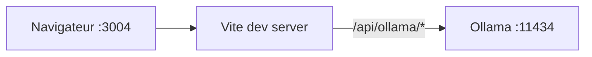

# Architecture — OpenSpace Localhost

## Vue d’ensemble

Application **SPA** React montée sur Vite. Aucun serveur applicatif Node dédié en dev : le serveur Vite sert les assets et proxy les appels Ollama.

## Arborescence `src/`

| Élément | Rôle |
|---------|------|
| `App.tsx` | État global : conversations, conversation active, onglet principal, modèle Ollama |
| `components/Layout.tsx` | Grille trois colonnes |
| `components/Sidebar.tsx` | Liste conversations + actions |
| `components/ChatPanel.tsx` | Messages, saisie, streaming |
| `components/TeamPanel.tsx` | Arbre hiérarchique (Orchestrateur, agents, sous-agents) — logique Ollama à venir |
| `lib/ollama.ts` | Client API Ollama (tags + chat stream) |
| `lib/storage.ts` | Sérialisation `localStorage` |
| `types.ts` | Types partagés |

## Flux Chat

1. L’utilisateur envoie un message → ajout message `user` + bulle `assistant` vide.
2. `streamOllamaChat` lit le corps NDJSON ligne par ligne et concatène `message.content`.
3. À chaque chunk, mise à jour immuable des messages de la conversation active.
4. En cas d’erreur, suppression de la bulle assistant vide et affichage d’une bannière.

## Évolutions prévues (non codées)

- Agents multiples dans l’onglet Équipe, routage vers plusieurs appels modèle ou prompts système distincts.
- Colonne droite : contexte, pièces jointes, état d’exécution des agents.
